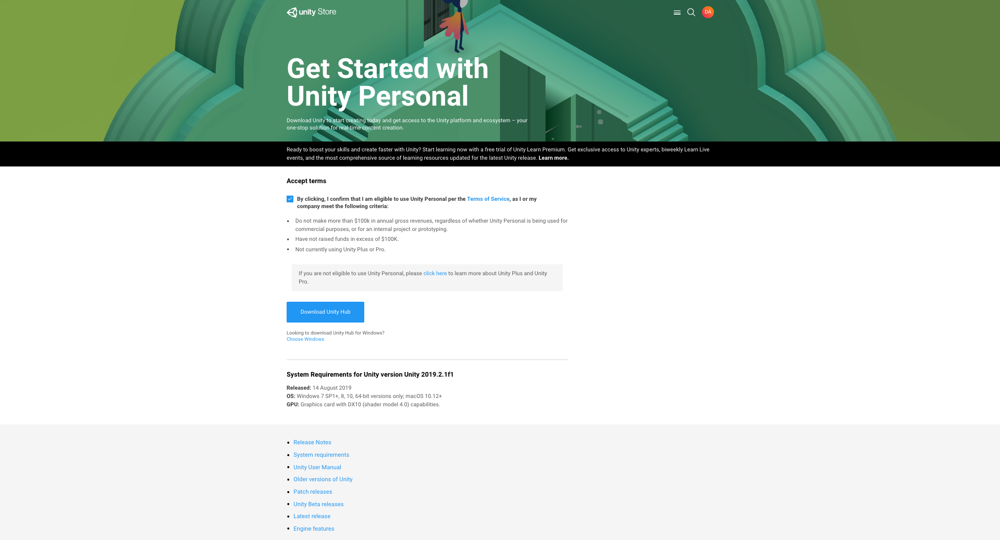
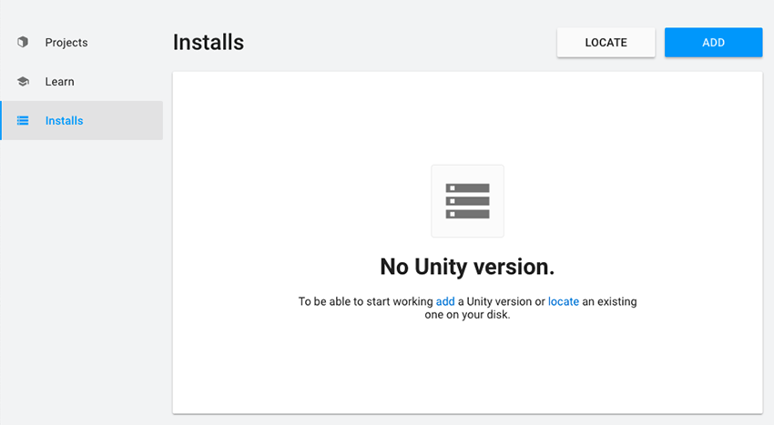
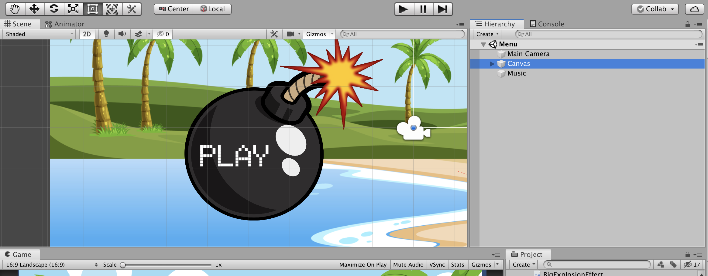

# DragonPirates

A 2D Side Scroller Involving Dragons, Pirates & Sharks

![Game Home Screen][game-home-screen]

## Team

| Carl                                                                                                                                                                    | Chris                                                                                                                                                                     | Danny                                                                                                                                                                    | Jake                                                                                                                                                                     | Remy                                                                                                                                                                         |
| ----------------------------------------------------------------------------------------------------------------------------------------------------------------------- | ------------------------------------------------------------------------------------------------------------------------------------------------------------------------- | ------------------------------------------------------------------------------------------------------------------------------------------------------------------------ | ------------------------------------------------------------------------------------------------------------------------------------------------------------------------ | ---------------------------------------------------------------------------------------------------------------------------------------------------------------------------- |
|  |  |  |  |  |

### Instructions for use:

1. Go to [this](https://store.unity.com/download) link & install Unity hub. You'll need to create a free Unity account

2. Open Unity Hub & install `Unity 19.2.0f1`

3. Git clone this repo

4. Open the project, then open the `Unity_game` folder in Unity Hub.

   The project will open and install the required assets.

5. Once loaded, press the play button

_Tap on spacebar to simulate user touch_

### Instructions for use on Android Mobile devices

- Use android file transfer on laptop to drag and drop the ./TestDP.apk

## DEVELOPER INSTRUCTIONS

- Deploying Unity App

* - Download Android SDK Tools from the internet
* - Locate the tools in Unity via Preferences/External Tools (it should auto find)
* - In Unity, create a key using Keystore:     Go to File/Build Settings, select Android in Platform and click Player Settings... Here you will find the Keystore Manager. Select from the dropdown: select existing. Then browse to ./KEYSTORE.keystore.   Then use the password to load the key.   You will now be able to go to Build Settings again and Build the application.   Follow the "Instructions for use on Android Mobile devices" to load the app on a device.

### Technology Stack:

| C#                       | Unity                     | Visual Studio                             | Android                       |
| ------------------------ | ------------------------- | ----------------------------------------- | ----------------------------- |
| ![C Sharp Logo][c#-logo] | ![Unity logo][unity-logo] | ![Visual Studio Logo][visual-studio-logo] | ![Android Logo][android-logo] |

[c#-logo]: images/csharp-logo.png 'C sharp Logo'
[unity-logo]: images/unity-logo-black.png 'Unity Logo'
[visual-studio-logo]: images/visualstudio-logo.png 'Visual Studio Logo'
[android-logo]: images/screenshots/Android-Logo.png 'Android Logo'
[game-home-screen]: images/screenshots/game-home-screen.png 'Game Home Screen'

### MVP

For the MVP we have a basic game. In which the dragon main character can infinitely fly through the level, avoiding pirates and flying through scorezones.

### Version 1 - In progress

- [ ] User can enter their name so that their score can be logged.
- [x] User can Start game to initialise Dragons of The Pirates.
- [x] User can press the screen to make the Dragon fly.
- [x] User can guide the Dragon between the parrot and the Pirate enemy, to gain a score point
- [x] User can see their score
- [x] User can die if the Dragon lands
- [x] User can die if the Dragon is hit by a Pirate
- [x] User can see Game Over screen when the Dragon has died
- [ ] User can see their position on LeaderBoard when game over

### Version 2 - backlog
